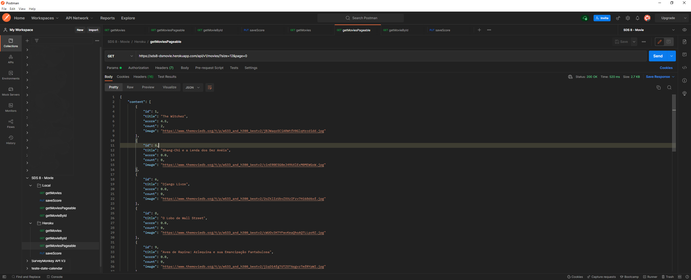

# SDS 8 - DSMovie: Semana Spring React

### This project uses the following technologies:

* Java Development Kit (JDK) 11
* Spring: [Boot, Data JPA, Security, Web, Test]
* Maven
* JUnit 5
* Database: [PostgreSQL 14, H2]
* Heroku
* Vercel

### Project Setup (Windows)

Click   to see the instalations:
Click   to see the main maven-goals:

|    **Name**     |           **Github**            |     **Role**      |
|:---------------:|:-------------------------------:|:-----------------:|
| Dr. Nélio Alves |   https://github.com/acenelio   |    Instructor     |
|  Robson Sousa   | https://github.com/robsoncartes | Student/Developer |

Front-end repository: https://github.com/robsoncartes/frontend-dsmovie \
The front-end application is accessible on: https://frontend-dsmovie.vercel.app/

