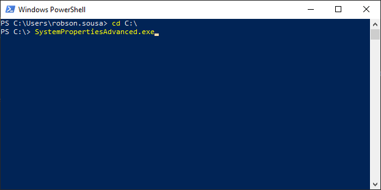
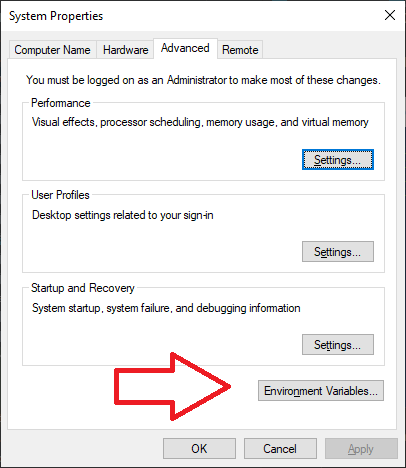
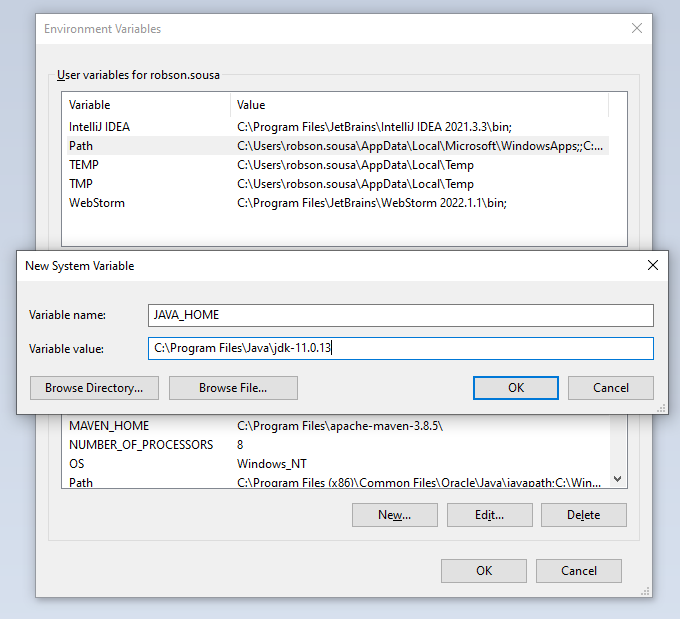
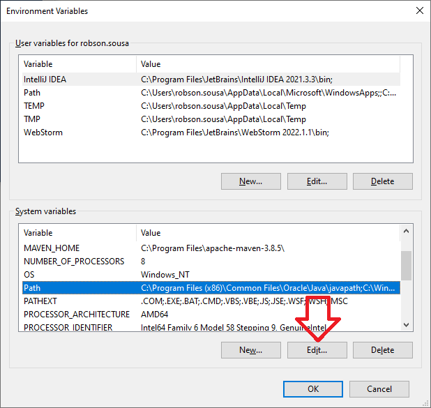
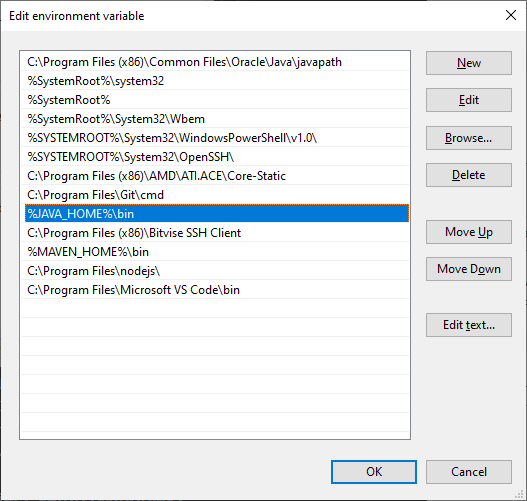
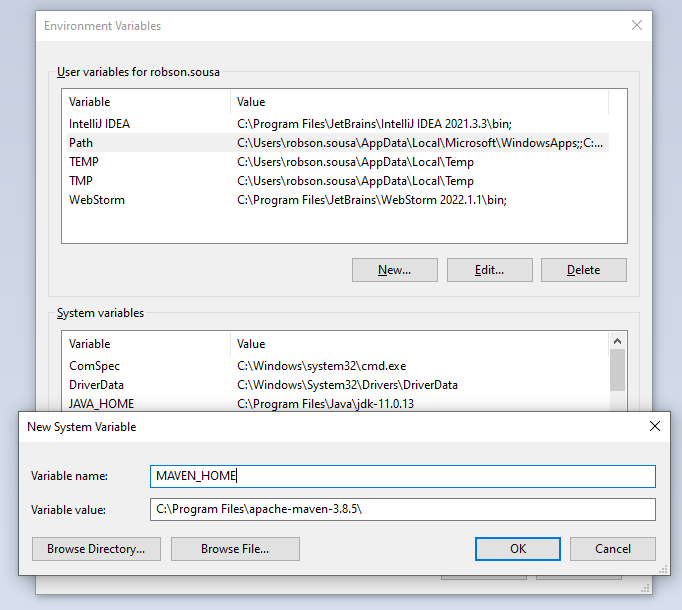
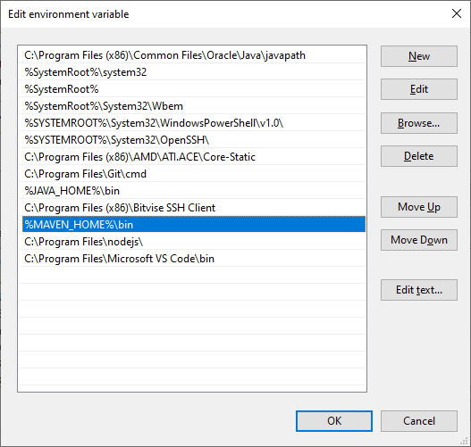
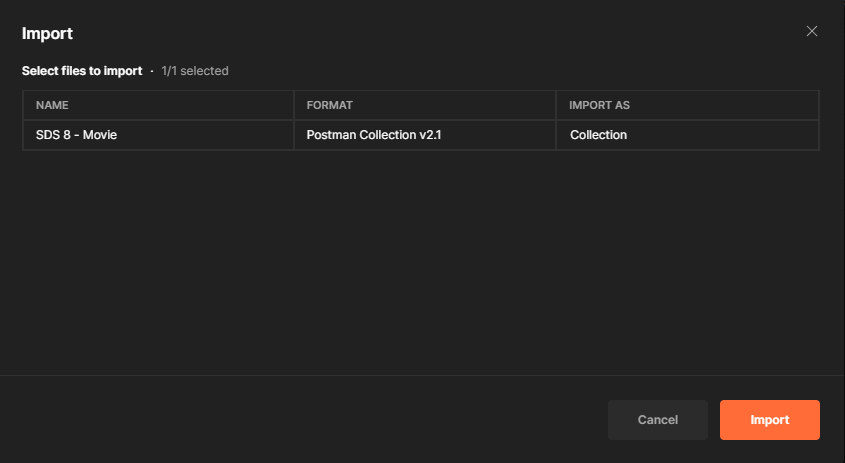

**Java JDK Installation**

* Download Maven: https://maven.apache.org/download.cgi
* Extract files to folder with apropriate name
* Copy the files to i.e.g C:\Program Files\Java\jdk-11.0.13
* Open PowerShell or CMD
* Run 'SystemPropertiesAdvanced.exe'

* Click 'New' on Environment Variables button...

* In New System Variable popup, give a Variable Name like 'JAVA_HOME' and Variable Value like C:\Program
  Files\Java\jdk-11.0.13\

* In Enviroment Variables > System variables, choose Path and click on Edit...button.

* Click in New button and give a name i.e.g %JAVA_HOME%\bin and press OK button.

**Maven Installation**

* Download Maven: https://maven.apache.org/download.cgi
* Extract files to folder with apropriate name
* Copy the files to i.e.g C:\Program Files\apache-maven-3.8.5
* Open PowerShell or CMD
* Run 'SystemPropertiesAdvanced.exe'

* Click 'New' on Environment Variables button...

* In New System Variable popup, give a Variable Name like 'MAVEN_HOME' and Variable Value like C:\Program
  Files\apache-maven-3.8.5\

* In Enviroment Variables > System variables, choose Path and click on Edit...button.

* Click in New button and give a name i.e.g %MAVEN_HOME%\bin and press OK button.

**POSTMAN Installation**

Download POSTMAN: https://www.postman.com/downloads/

* Install POSTMAN
* Open POSTMAN, click in File >> Import >> File >> Upload Files
* Choose the 'SDS 8 - Movie.postman_collection.json' to load.

* press Import button.

